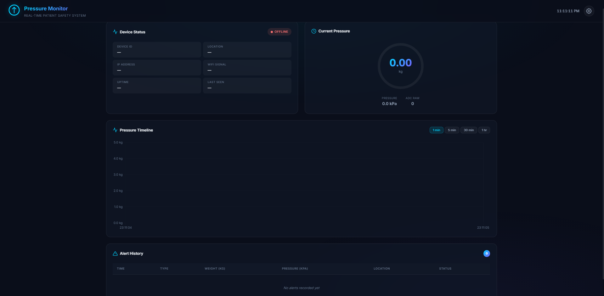

<div align="center">

# 🩺 Pressure Monitoring System

### 🛡️ Real-time IoT Pressure Monitoring for Patient Bedsore Prevention

[](https://www.espressif.com/)
[](https://firebase.google.com/)
[](https://core.telegram.org/bots)
[](LICENSE)

**ESP32 + RFP-602 Sensor → Firebase Realtime DB → Web Dashboard + Telegram Alerts**

🌐 [ภาษาไทย (Thai Version)](./README.th.md)

</div>

---

## 📸 Demo

<div align="center">
  
</div>

---

## ✨ Features

| Feature | Description |
|---------|-------------|
| 📊 **Real-time Dashboard** | Beautiful dark-themed web dashboard with live pressure chart |
| 🎯 **Live Gauge** | Circular pressure gauge with color-coded levels (🟢 🟡 🔴) |
| 📡 **Device Status** | Real-time online/offline monitoring with WiFi signal strength |
| 🚨 **Telegram Alerts** | Instant push notifications for abnormal or prolonged pressure |
| ⏱️ **Continuous Timer** | Configurable alert timer for sustained pressure (default: 30 min) |
| 📈 **History Logging** | Complete alert history with timestamps and severity levels |
| 🔵 **WiFi LED** | Pin 18 — Blue LED indicates WiFi connection status |
| 🟡 **Press LED** | Pin 19 — LED lights up when pressure is detected |
| 🔒 **Secure Auth** | Firebase Authentication for secure data transmission |

---

## 🏗️ System Architecture

```
┌─────────────┐     ┌──────────────────┐     ┌─────────────┐
│  RFP-602    │────►│  Conversion      │────►│   ESP32     │
│  Sensor     │     │  Module          │     │   DevKit    │
└─────────────┘     └──────────────────┘     └──────┬──────┘
                                                     │ WiFi
                                              ┌──────┴──────┐
                                              │  Firebase   │
                                              │  Realtime   │
                                              │  Database   │
                                              └──┬──────┬───┘
                                                 │      │
                                          ┌──────┴──┐ ┌─┴────────┐
                                          │ Web     │ │ Telegram │
                                          │Dashboard│ │ Bot API  │
                                          └─────────┘ └──────────┘
```

---

## 📁 Project Structure

```
📦 Pressure_Iot/
├── 📟 esp32/
│   ├── esp32_pressure_monitor.ino   # 🎯 Main ESP32 firmware
│   └── config.h                      # ⚙️ All configuration constants
├── 🔥 firebase/
│   ├── database.rules.json           # 🔒 Security rules
│   └── README.md                     # 📖 Firebase setup guide
├── 📊 dashboard/
│   ├── index.html                    # 🌐 Dashboard entry point
│   ├── css/style.css                 # 🎨 Dark theme stylesheet
│   └── js/app.js                     # ⚡ Firebase listeners & Chart.js
├── 📸 Demo/                          # 🖼️ Demo screenshots
├── 🔌 WIRING_DIAGRAM.md             # 🔧 Hardware wiring guide
├── 🇹🇭 README.th.md                 # 📖 Thai documentation
└── 📖 README.md                      # 📖 This file (English)
```

---

## 🔌 Hardware Wiring

### Components

| # | Component | Description |
|:-:|-----------|-------------|
| 1 | 🟦 **ESP32 Dev Board** | 30/38-pin DevKit V1 |
| 2 | 🟠 **RFP-602 Sensor** | Thin film pressure sensor (0–5 kg) |
| 3 | 🟩 **Conversion Module** | Resistance → Voltage converter |

### Pin Connections

| Module Pin | ESP32 Pin | Purpose |
|:----------:|:---------:|---------|
| VCC | **3V3** | ⚡ Power supply (3.3V only!) |
| GND | **GND** | ⏚ Common ground |
| AO | **GPIO 34** | 📊 Analog pressure reading |
| DO | **GPIO 35** | 🔢 Digital threshold (optional) |

### LED Indicators

| LED | ESP32 Pin | Behavior |
|:---:|:---------:|----------|
| 🔵 Blue | **GPIO 18** | ON = WiFi connected |
| 🟡 Yellow | **GPIO 19** | ON = Pressure detected |

> ⚠️ **Important:** Use **3.3V only!** Connecting 5V to AO will damage the ESP32.

📖 See [WIRING_DIAGRAM.md](./WIRING_DIAGRAM.md) for detailed wiring instructions.

---

## 🚀 Quick Start

### 1️⃣ Arduino IDE Setup

**Install Board Support:**
```
Arduino IDE → File → Preferences → Additional Board URLs:
https://raw.githubusercontent.com/espressif/arduino-esp32/gh-pages/package_esp32_index.json
```

**Required Libraries:**

| Library | Author | Install via |
|---------|--------|-------------|
| 🔥 **Firebase ESP32 Client** | Mobizt | Library Manager |
| 📋 **ArduinoJson** | Benoit Blanchon | Library Manager |

### 2️⃣ Firebase Setup

1. 🌐 Create project at [console.firebase.google.com](https://console.firebase.google.com)
2. 🗄️ Enable **Realtime Database** (Singapore region)
3. 🔑 Enable **Email/Password Authentication** → Create device user
4. 📋 Copy **API Key** + **Database URL**
5. 🔒 Deploy security rules from `firebase/database.rules.json`

📖 See [firebase/README.md](./firebase/README.md) for step-by-step guide.

### 3️⃣ Configure & Upload

Edit `esp32/config.h` with your credentials:

```c
#define WIFI_SSID          "your_wifi"
#define WIFI_PASSWORD      "your_password"
#define FIREBASE_HOST      "your-project.firebasedatabase.app"
#define FIREBASE_API_KEY   "AIzaSy..."
#define TELEGRAM_BOT_TOKEN "123456:ABC..."
#define TELEGRAM_CHAT_ID   "987654321"
```

Select **ESP32 Dev Module** → Upload! 🚀

### 4️⃣ Open Dashboard

```bash
# Option 1: Just double-click
open dashboard/index.html

# Option 2: Local server
cd dashboard && npx serve .

# Option 3: Firebase Hosting
firebase deploy
```

Click ⚙️ → Enter API Key + Database URL → **Connect** ✅

---

## 📲 Telegram Alerts

| Alert Type | Trigger | Emoji |
|:----------:|---------|:-----:|
| 🚨 **Abnormal Pressure** | Weight ≥ 4.5 kg | Instant alert |
| ⏱️ **Continuous Pressure** | >30 min sustained | Repositioning needed |
| ✅ **Device Online** | ESP32 boots up | System ready |

---

## ⚙️ Configuration

All adjustable parameters in `config.h`:

| Parameter | Default | Description |
|-----------|:-------:|-------------|
| `PRESSURE_THRESHOLD_KG` | 0.5 kg | Minimum weight for detection |
| `CONTINUOUS_PRESSURE_MINUTES` | 30 min | Duration before alert |
| `ABNORMAL_PRESSURE_KG` | 4.5 kg | Instant alert threshold |
| `ALERT_COOLDOWN_SECONDS` | 300 s | Min gap between alerts |
| `ADC_PRESS_THRESHOLD` | 2000 | ADC below this = pressed |
| `MOVING_AVG_SAMPLES` | 20 | Noise smoothing window |

> 💡 **Inverted Logic:** Lower ADC value = Higher pressure (RFP-602 characteristic)

---

## 🔒 Security

- 🔐 Firebase Auth required for database writes
- 👁️ Public read access for dashboard (no login needed)
- 🤖 Telegram credentials stored on ESP32 only
- 🛡️ For production: add HTTPS, rate limiting, and CORS restrictions

---

## 🛠️ Tech Stack

<div align="center">

| Layer | Technology |
|:-----:|:----------:|
| 📟 MCU | ESP32 + Arduino |
| 🗄️ Database | Firebase Realtime DB |
| 🚨 Alerts | Telegram Bot API |
| 📊 Frontend | HTML/CSS/JS + Chart.js |
| 🎨 Design | Glassmorphism Dark Theme |

</div>

---

## 👨‍💻 Author

Made with ❤️ for patient safety

---

<div align="center">

⭐ **Star this repo if you found it useful!** ⭐

</div>
