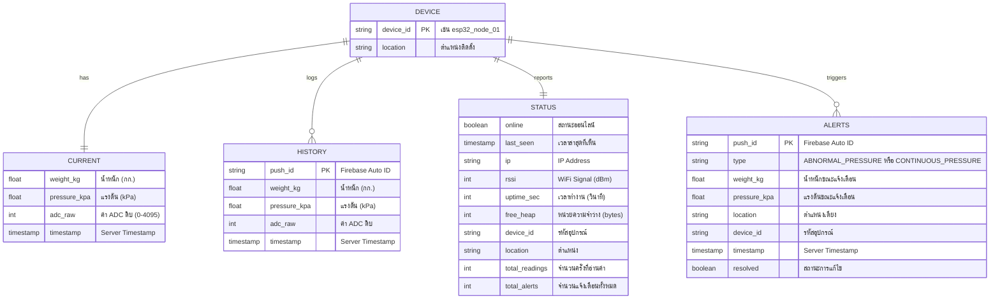

<div align="center">

# 🩺 Pressure Monitoring System

### Real-time IoT Pressure Monitoring for Patient Bedsore Prevention

[](https://www.espressif.com/)
[](https://firebase.google.com/)
[](https://core.telegram.org/bots)
[](LICENSE)

[](https://www.youtube.com/watch?v=_hwR8I9PEMo)

**ESP32 + RFP-602 Sensor → Firebase Realtime DB → Web Dashboard + Telegram Alerts**

🌐 [ภาษาไทย (Thai Version)](./README.th.md)

</div>

---

## 📸 Demo

<div align="center">
  
</div>

---

## 1. ที่มาและเหตุผล (Background & Rationale)

ผู้ป่วยติดเตียงมีความเสี่ยงสูงต่อการเกิด **แผลกดทับ (Pressure Ulcer / Bedsore)** อันเป็นผลจากแรงกดทับที่กระทำต่อผิวหนังเป็นเวลานานโดยไม่ได้รับการพลิกตัว ปัญหานี้พบได้บ่อยในโรงพยาบาลและสถานดูแลผู้สูงอายุ ส่งผลให้ผู้ป่วยเจ็บปวด เสี่ยงต่อการติดเชื้อ และเพิ่มค่าใช้จ่ายในการรักษา

**วัตถุประสงค์ของโครงงาน:**
1. ออกแบบและพัฒนาระบบ IoT สำหรับตรวจจับแรงกดบนเตียงผู้ป่วยแบบ Real-time
2. แจ้งเตือนผู้ดูแลผ่าน Telegram Bot เมื่อตรวจพบแรงกดที่ผิดปกติหรือกดค้างนานเกินไป
3. จัดเก็บข้อมูลและแสดงผลผ่าน Web Dashboard เพื่อวิเคราะห์แนวโน้ม

**ประโยชน์ที่คาดว่าจะได้รับ:**
- ลดอุบัติการณ์แผลกดทับในผู้ป่วยติดเตียง
- ช่วยให้ผู้ดูแลตอบสนองได้ทันท่วงที
- มีข้อมูลประวัติย้อนหลังสำหรับวิเคราะห์รูปแบบการนอน

---

## 2. ทฤษฎี IoT ที่นำมาใช้ (IoT Theory & Architecture)

โครงงานนี้ออกแบบตาม **IoT 3-Layer Architecture:**

| Layer | รายละเอียด | เทคโนโลยี |
|-------|-----------|-----------|
| **Perception Layer** | เซ็นเซอร์ RFP-602 อ่านค่าแรงกด แปลงเป็นสัญญาณ Analog | ESP32 ADC 12-bit, Moving Average Filter |
| **Network Layer** | ส่งข้อมูลผ่าน WiFi ไปยัง Cloud | WiFi (IEEE 802.11), HTTPS Protocol |
| **Application Layer** | แสดงผล Dashboard + แจ้งเตือน Telegram | Firebase RTDB, Web App, Telegram Bot API |

### Protocol ที่ใช้

| Protocol | การใช้งาน |
|----------|----------|
| **HTTPS** | ESP32 → Firebase RTDB (REST API ผ่าน Firebase SDK) |
| **HTTPS** | ESP32 → Telegram Bot API (`api.telegram.org`) |
| **WebSocket** | Dashboard ← Firebase RTDB (Real-time listener) |
| **NTP** | ESP32 ← `pool.ntp.org` (ซิงค์เวลา UTC+7) |

### Cloud Services

- **Firebase Realtime Database** — ฐานข้อมูล NoSQL แบบ Real-time, ซิงค์ข้อมูลอัตโนมัติ
- **Firebase Authentication** — ยืนยันตัวตน ESP32 ด้วย Email/Password
- **Telegram Bot API** — ส่ง Push Notification แจ้งเตือนผู้ดูแล

---

## 3. โครงสร้างโปรเจค (Project Structure)

```
Pressure_Iot/
├── 📟 esp32/
│   ├── esp32_pressure_monitor.ino   # โค้ดหลัก ESP32 (521 บรรทัด)
│   └── config.h.example             # ตัวอย่างไฟล์ตั้งค่า
├── 🔥 firebase/
│   ├── database.rules.json           # Security Rules
│   └── README.md                     # คู่มือตั้งค่า Firebase
├── 📊 dashboard/
│   ├── index.html                    # หน้า Dashboard (361 บรรทัด)
│   ├── css/style.css                 # สไตล์ชีท Dark Theme (917 บรรทัด)
│   └── js/app.js                     # JavaScript Logic (481 บรรทัด)
├── 📸 Demo/                          # รูปภาพ Demo
├── 🔌 WIRING_DIAGRAM.md             # แผนผังการต่อสาย
├── 📖 README.md                      # เอกสาร (English + Thai)
└── 📖 README.th.md                   # เอกสาร (Thai)
```

---

## 4. การอธิบายโค้ด (Code Explanation)

### 4.1 ESP32 Firmware (`esp32_pressure_monitor.ino`)

| ฟังก์ชัน | หน้าที่ |
|----------|--------|
| `setup()` | ตั้งค่าพิน, เชื่อมต่อ WiFi (WiFiManager), เปิด AP+STA Mode, ซิงค์ NTP, เริ่ม Firebase |
| `loop()` | วนลูปอ่าน Sensor → ส่ง Firebase → ตรวจสอบ Alert ตามช่วงเวลาที่กำหนด |
| `readSensor()` | อ่านค่า ADC จาก GPIO34 ผ่าน Moving Average Filter (20 ตัวอย่าง) |
| `mapADCToWeight()` | แปลง ADC (Inverted Logic: 4095=ไม่กด, 0=กดเต็ม) เป็นน้ำหนัก 0–5 kg |
| `pushDataToFirebase()` | เขียนข้อมูล `current` และ `history` ลง Firebase ทุก 2 วินาที |
| `sendHeartbeat()` | อัปเดต `status` (online, IP, RSSI, uptime) ทุก 10 วินาที |
| `checkPressureAlerts()` | ตรวจสอบ 2 เงื่อนไข: แรงกด ≥4.5 kg (ผิดปกติ) หรือกดค้าง >10 วินาที |
| `sendTelegramMessage()` | ส่ง HTTPS POST ไปยัง Telegram Bot API พร้อม Markdown |
| `checkResetButton()` | กดปุ่ม BOOT ค้าง 3 วินาที → ล้าง NVS + WiFi Credentials |
| `connectWiFi()` | ใช้ WiFiManager Captive Portal ตั้งค่า WiFi ผ่านมือถือ |

### 4.2 Dashboard (`dashboard/js/app.js`)

| ส่วน | หน้าที่ |
|------|--------|
| Firebase Listener | `db.ref().on('value')` — รับข้อมูล Real-time จาก Firebase |
| Gauge | SVG Circular Gauge แสดงน้ำหนักปัจจุบัน พร้อมเปลี่ยนสี 🟢🟡🔴 |
| Chart | Chart.js Line Chart แสดง Timeline (1 นาที – 1 ชั่วโมง) |
| Alerts Table | ตาราง Alert History เรียงตาม Timestamp ล่าสุด |
| Settings Modal | กรอก Firebase API Key + DB URL, เก็บใน localStorage |

---

## 5. Data Flow Diagram (การรับ-ส่งข้อมูล)

```
┌─────────────────────────────────────────────────────────────────────┐
│                     DATA FLOW DIAGRAM                               │
│              Pressure Monitoring IoT System                         │
└─────────────────────────────────────────────────────────────────────┘

  ┌──────────┐    Analog     ┌──────────┐    ADC      ┌──────────────┐
  │ RFP-602  │───(0-3.3V)──►│Conversion│──(GPIO34)──►│    ESP32     │
  │ Sensor   │    Signal     │ Module   │   12-bit    │  DevKit V1   │
  └──────────┘               └──────────┘             └──────┬───────┘
                                                             │
                              ┌───────────────────────────────┼────────┐
                              │            WiFi (HTTPS)       │        │
                              ▼                               ▼        │
                 ┌────────────────────┐         ┌──────────────────┐   │
                 │  Firebase RTDB     │         │  Telegram Bot    │   │
                 │  (Cloud NoSQL)     │         │  API Server      │   │
                 │                    │         │                  │   │
                 │  /sensors/{id}/    │         │  POST /send      │   │
                 │    ├── current     │         │  Message         │   │
                 │    ├── history     │         └────────┬─────────┘   │
                 │    ├── status      │                  │             │
                 │    └── alerts      │                  ▼             │
                 └────────┬───────────┘         ┌──────────────────┐   │
                          │                     │  📱 Telegram     │   │
                          │ WebSocket           │  (ผู้ดูแล)       │   │
                          │ (Real-time)         └──────────────────┘   │
                          ▼                                            │
                 ┌────────────────────┐         ┌──────────────────┐   │
                 │  📊 Web Dashboard  │         │  💡 LED Status   │◄──┘
                 │  (Browser)         │         │  GPIO18: WiFi    │
                 │                    │         │  GPIO19: Press   │
                 │  - Live Gauge      │         └──────────────────┘
                 │  - Pressure Chart  │
                 │  - Alert History   │
                 │  - Device Status   │
                 └────────────────────┘
```

### สรุป Protocol Flow

| ทิศทาง | Protocol | รายละเอียด |
|--------|----------|-----------|
| ESP32 → Firebase | HTTPS (Firebase SDK) | `setJSON()` เขียนข้อมูล Sensor ทุก 2 วินาที |
| ESP32 → Telegram | HTTPS POST | ส่ง JSON payload ไปยัง `api.telegram.org` |
| ESP32 ← NTP | UDP (NTP) | ซิงค์เวลา UTC+7 จาก `pool.ntp.org` |
| Dashboard ← Firebase | WebSocket | `on('value')` รับข้อมูลอัตโนมัติ |
| Dashboard → Firebase | HTTPS | อ่านค่าผ่าน Firebase JS SDK |

---

## 6. E-R Diagram (การออกแบบฐานข้อมูล)

ระบบใช้ **Firebase Realtime Database (NoSQL)** เก็บข้อมูลแบบ JSON Tree โดยจำลอง Entity ดังนี้:



### โครงสร้าง JSON ใน Firebase

```json
{
  "sensors": {
    "esp32_node_01": {
      "current": {
        "weight_kg": 1.25,
        "pressure_kpa": 122.6,
        "adc_raw": 2948,
        "timestamp": 1710612345000
      },
      "history": {
        "-Nxyz123abc": {
          "weight_kg": 1.25,
          "pressure_kpa": 122.6,
          "adc_raw": 2948,
          "timestamp": 1710612345000
        }
      },
      "status": {
        "online": true,
        "last_seen": 1710612345000,
        "ip": "192.168.1.100",
        "rssi": -45,
        "uptime_sec": 3600
      },
      "alerts": {
        "-Nxyz456def": {
          "type": "CONTINUOUS_PRESSURE",
          "weight_kg": 2.30,
          "timestamp": 1710612345000,
          "resolved": false
        }
      }
    }
  }
}
```

### Normalization สำหรับ NoSQL

| หลักการ | การนำไปใช้ |
|---------|-----------|
| **Denormalization** | `device_id` และ `location` ถูกเก็บซ้ำใน `alerts` เพื่อให้ Query ได้โดยไม่ต้อง JOIN |
| **Flat Structure** | แยก `current`, `history`, `status`, `alerts` เป็น Node ย่อยแทนการ Nest ลึก |
| **Indexing** | ใช้ `.indexOn: ["timestamp"]` สำหรับ `history` และ `alerts` เพื่อเรียงตามเวลา |
| **Security Rules** | อ่านได้ทุกคน (Dashboard), เขียนได้เฉพาะ Authenticated (ESP32) |

---

## 7. Dashboard

### คุณสมบัติ

| Feature | Description |
|---------|-------------|
| 📊 **Real-time Gauge** | SVG Circular Gauge แสดงน้ำหนัก พร้อมเปลี่ยนสีตามระดับ (🟢🟡🔴) |
| 📈 **Live Chart** | Chart.js Line Chart แสดง Timeline ปรับช่วง 1 นาที – 1 ชั่วโมง |
| 📡 **Device Status** | แสดง Online/Offline, IP, WiFi Signal, Uptime แบบ Real-time |
| 🚨 **Alert History** | ตาราง Log แจ้งเตือนพร้อม Type, Weight, Location, Status |
| ⚙️ **Settings Modal** | กรอก Firebase API Key + DB URL เก็บใน localStorage |
| 📶 **WiFi Guide** | คู่มือตั้งค่า WiFi สำหรับผู้ใช้ทั่วไป |

### เทคโนโลยี UI/UX

- **Dark Theme** พร้อม Glassmorphism effect
- **Google Fonts (Inter)** สำหรับ Typography ที่อ่านง่าย
- **CSS Grid Layout** แบบ Responsive
- **Micro-animations** (fadeSlideUp, pulse, scaleIn)
- **Chart.js** สำหรับกราฟ Real-time
- **Firebase JS SDK (Compat)** สำหรับ WebSocket Listener

---

## 8. การออกแบบวงจร (Circuit Design)

### อุปกรณ์ที่ใช้

| # | อุปกรณ์ | รายละเอียด |
|---|---------|-----------|
| 1 | ESP32 DevKit V1 | ไมโครคอนโทรลเลอร์ 30-pin, WiFi+BT |
| 2 | RFP-602 Thin Film Sensor | เซ็นเซอร์แรงกด 0–5 kg |
| 3 | Conversion Module | แปลงความต้านทาน → แรงดัน Analog |
| 4 | LED สีฟ้า + ตัวต้านทาน 220Ω | แสดงสถานะ WiFi |
| 5 | LED แสดงการกด + ตัวต้านทาน 220Ω | แสดงสถานะแรงกด |

### แผนผังการต่อสาย

```
                ┌─────────────┐
                │   RFP-602   │
                │  (on bed)   │
                └──┬─────┬────┘
                   │     │  (2 wires, no polarity)
            ┌──────┴─────┴──────┐
            │  Conversion Module │
            │ VCC GND AO   DO   │
            └──┬──┬───┬────┬────┘
               │  │   │    │
               │  │   │    └───── GPIO 35 (Digital, สำรอง)
               │  │   └──────── GPIO 34 (Analog Read)
               │  └──────────── GND (กราวด์ร่วม)
               └─────────────── 3V3 (⚠️ ห้ามใช้ 5V!)
            ┌──┴──┴───┴────┴────┐
            │      ESP32         │
            │                    │
            │  GPIO18 → 220Ω → 🔵 LED (WiFi)
            │  GPIO19 → 220Ω → 🟡 LED (Press)
            │  GPIO0  = ปุ่ม BOOT (Reset WiFi)
            │                    │
            │   [USB] ← Power    │
            └────────────────────┘
```

### ตารางขาพิน

| ขาโมดูล | ขา ESP32 | หน้าที่ |
|---------|----------|--------|
| VCC | 3V3 | จ่ายไฟ 3.3V |
| GND | GND | กราวด์ร่วม |
| AO | GPIO 34 | อ่านค่า Analog (ADC1_CH6) |
| DO | GPIO 35 | Digital Output (สำรอง) |
| — | GPIO 18 | LED สีฟ้า (สถานะ WiFi) |
| — | GPIO 19 | LED แสดงการกด |
| — | GPIO 0 | ปุ่ม BOOT (Reset WiFi กดค้าง 3 วิ) |

> ⚠️ **สำคัญ:** GPIO 34 และ 35 เป็นขา Input-Only บน ESP32 เหมาะสำหรับอ่านค่าเซ็นเซอร์

---

## ✨ Features Summary

| Feature | Description |
|---------|-------------|
| 📊 **Real-time Dashboard** | Dark-themed web dashboard with live pressure chart |
| 🎯 **Live Gauge** | Circular pressure gauge with color-coded levels |
| 📡 **Device Status** | Real-time online/offline monitoring with WiFi signal |
| 🚨 **Telegram Alerts** | Instant push notifications for abnormal pressure |
| ⏱️ **Continuous Timer** | Alert for sustained pressure (configurable) |
| 📈 **History Logging** | Complete alert history with timestamps |
| 📶 **WiFiManager** | Configure WiFi via mobile captive portal |
| 🔄 **WiFi Reset** | Hold BOOT button 3s to reset WiFi credentials |

---

## ⚙️ ค่าที่ปรับได้ (Configurable)

| ค่า | ค่าเริ่มต้น | คำอธิบาย |
|-----|:---------:|---------:|
| `PRESSURE_THRESHOLD_KG` | 0.5 kg | น้ำหนักขั้นต่ำที่ถือว่ามีแรงกด |
| `CONTINUOUS_PRESSURE_SECONDS` | 10 s (Demo) | เวลากดค้างก่อนแจ้งเตือน |
| `ABNORMAL_PRESSURE_KG` | 4.5 kg | แจ้งเตือนทันทีถ้าเกินค่านี้ |
| `ALERT_COOLDOWN_SECONDS` | 15 s (Demo) | ช่วงเวลาขั้นต่ำระหว่างแจ้งเตือน |
| `DATA_PUSH_INTERVAL_MS` | 2000 ms | ส่งข้อมูลไป Firebase ทุก 2 วินาที |
| `HEARTBEAT_INTERVAL_MS` | 10000 ms | ส่ง Heartbeat ทุก 10 วินาที |

> 💡 **โหมดจริง:** เปลี่ยน `CONTINUOUS_PRESSURE_SECONDS` เป็น `1800` (30 นาที)

---

## 📚 ไลบรารีที่ใช้

| ไลบรารี | เวอร์ชัน | การใช้งาน |
|---------|:-------:|----------|
| Firebase ESP32 Client | 4.x+ | เชื่อมต่อ Firebase RTDB |
| ArduinoJson | 7.x+ | สร้าง/แปลง JSON payload |
| WiFiManager | 2.x+ | Captive Portal ตั้งค่า WiFi |
| Chart.js | 4.4.1 | กราฟ Real-time บน Dashboard |
| Firebase JS SDK | 10.7.1 | WebSocket listener บน Dashboard |

---

## 🔒 ความปลอดภัย

- 🔐 Firebase ต้อง Authentication ก่อนเขียนข้อมูล
- 👁️ Dashboard อ่านข้อมูลได้โดยไม่ต้อง Login
- 🤖 API Keys เก็บใน `config.h` (อยู่ใน `.gitignore`)
- 🔑 ไฟล์ `config.h.example` แสดง Template โดยไม่มีค่าจริง

---

<div align="center">

⭐ **Pressure Monitoring System — IoT for Patient Safety** ⭐

</div>
